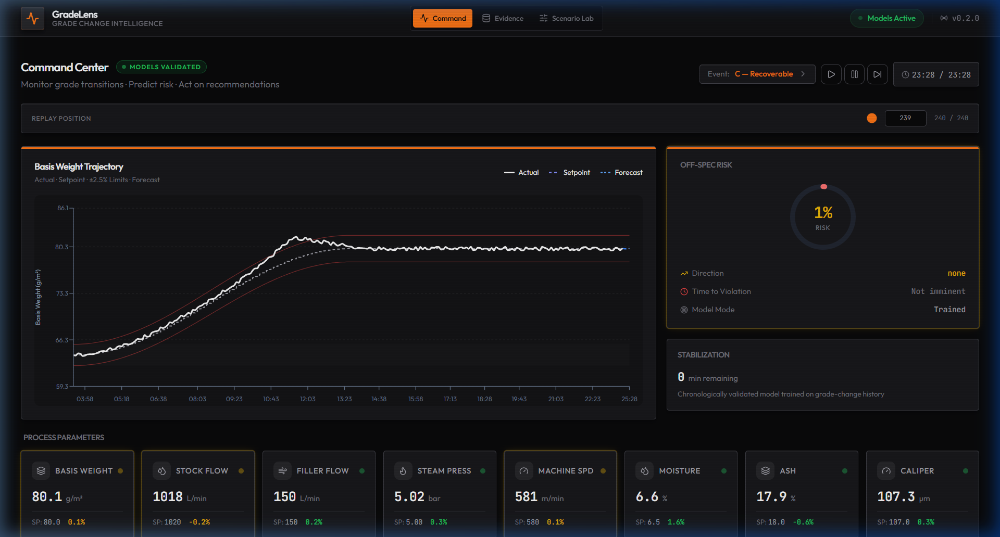
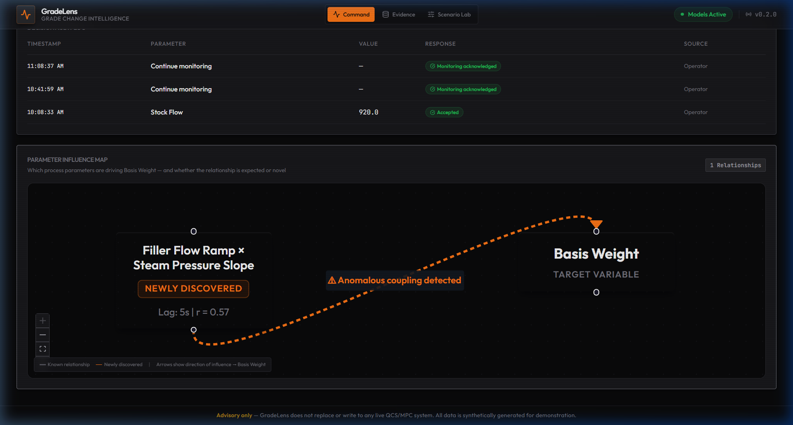
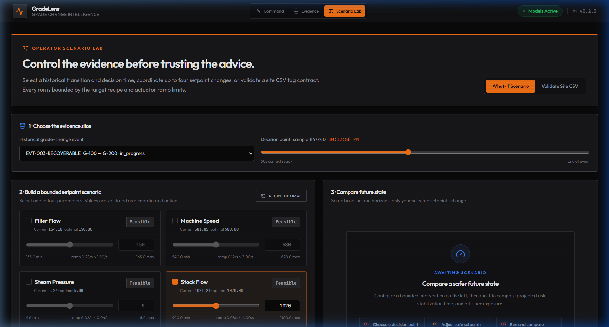
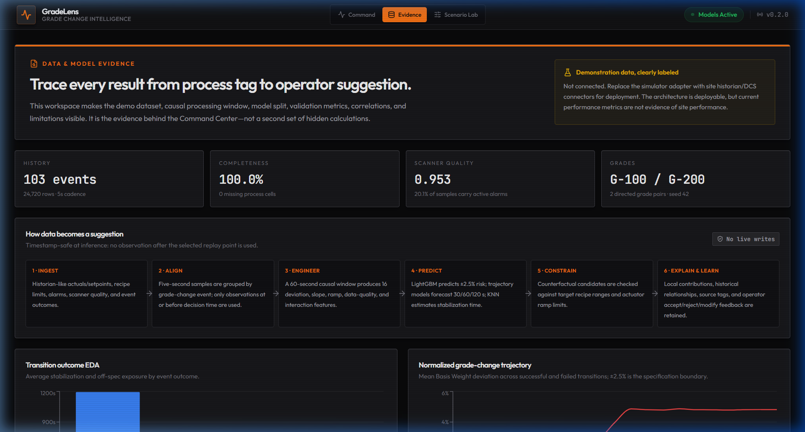

# GradeLens

<p align="center">
  <em>Explainable Grade Change Intelligence for Paper Manufacturing</em>
</p>



GradeLens is a sophisticated, AI-driven advisory layer designed to predict and prevent out-of-spec basis weight incidents during automatic grade transitions in paper manufacturing. Built with a strict focus on safety, explainability, and actionability, GradeLens operates entirely in an advisory capacity, putting critical insights directly in front of the operator before physical changes are made.

---

## Technical Stack

The application is built on a modern, decoupled architecture designed for high-performance data visualization and machine learning inference.

**Frontend:**
- **React 18 & TypeScript**: Component-driven UI development.
- **Vite**: Ultra-fast module bundler and development server.
- **TanStack Query**: Robust data fetching, caching, and state management for simulated live data streams.
- **Recharts & React Flow**: Complex, interactive data visualizations for timeseries forecasting and node-based influence mapping.

**Backend:**
- **FastAPI**: Asynchronous Python web framework for handling RESTful API routing and data serving.
- **Scikit-Learn**: Machine learning pipeline utilizing Random Forest Classifiers and K-Nearest Neighbors for predictive modeling.
- **SQLAlchemy & SQLite**: ORM and local database engine for persisting synthetic event data, constraints, and operator feedback.
- **Docker**: Containerization using multi-stage Dockerfiles for both frontend (Nginx) and backend services.

---

## Core Features & Mechanics

GradeLens separates its capabilities into distinct modules that give operators a complete view of historical trends, predictive risk, and system constraints.

### 1. Command Center & Trajectory Forecasting
The primary dashboard serves as the live monitoring hub. The ML layer ingests historical basis weight, steam pressure, and stock flow metrics to project trajectory forecasts 30, 60, and 120 seconds into the future. It actively flags potential specification deviations before they occur.

### 2. Parameter Influence Map
Instead of a standard correlation matrix, GradeLens utilizes a node-based graph to visually map relationships between actuators and paper quality. The engine automatically discovers and highlights both linear correlations and complex, lagged compound interactions (e.g., filler-flow ramp interacting with steam-pressure slope at a 45-second delay).



### 3. Scenario Lab
The Scenario Lab provides a sandbox environment for operators. Before accepting a system-generated recommendation, operators can construct their own bounded setpoint scenarios and run what-if analyses to simulate how the machine will respond, specifically predicting the ramp rate and required stabilization times.



### 4. Dynamic Evidence & Explainability
Machine learning models are heavily scrutinized in industrial environments. GradeLens addresses this by exposing its rationale entirely. The Intelligence page provides deep insight into model health, data splits, and causal processing flows. Every recommendation is backed by dynamic evidence tags that calculate live confidence intervals and projected business impact.



### 5. Fail-Closed Constraint Engine
Safety is the overriding priority. The recommendation service runs through a strict, fail-closed validation pipeline. If an AI-suggested setpoint change violates predefined safety bounds in the `RecipeConstraint` table, the system will instantly reject the recommendation and refuse to present it to the operator.

---

## Deployment Configuration

GradeLens is containerized and configured for zero-configuration deployments using Docker Compose. The architecture routes frontend traffic through an Nginx reverse proxy directly to the FastAPI container.

```bash
# To run the entire stack locally or on a production VM:
docker compose up --build -d
```
Access the application at `http://localhost:8080`.

---

## Disclaimer

- **Advisory Only**: GradeLens does not replace or write to any live Quality Control System (QCS) or Distributed Control System (DCS). It operates purely as an advisory, read-only dashboard.
- **Synthetic Data**: All data in this repository is synthetically generated upon application startup to demonstrate the system's capabilities. Seeded interaction relationships were deliberately engineered to validate the discovery engine's mathematical sensitivity.
